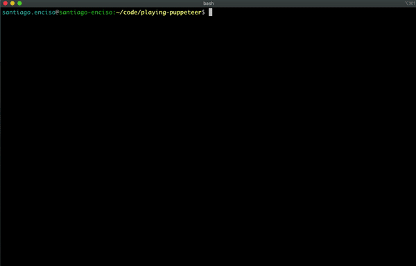

# Playing With Puppeteer :dolls:

Scraping App that uses Google's Puppeteer libary to check for items in Craigslist and returns the information in JSON.

Technologies used:

- Node.js
- [Puppeteer](https://www.npmjs.com/package/puppeteer)
- Inquirer



### Installation

- Clone repo
- Install dependencies

```
npm i
```

- Run App

```
node index.js
```
